# Fine-Grained Insect Pest Classification

This project builds a fine-grained image classification pipeline for insect pest recognition using the IP102 dataset. It compares several CNN-based baseline models with a dual-stream vision transformer model that combines Swin Transformer and BEiT representations for 102-class insect pest classification.

The workflow covers dataset preparation, exploratory checks, model training, test-set evaluation, per-class analysis, confusion matrices, classification reports, and Grad-CAM visualisation.

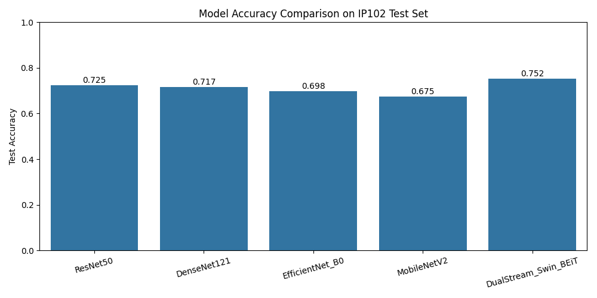

## Project Overview

Fine-grained insect pest classification is challenging because many insect pest categories have visually similar body shapes, colours, textures, and growth-stage variations. The IP102 dataset also contains a naturally long-tailed class distribution, making it more difficult than standard balanced image classification tasks.

This project investigates the task by comparing:

* ResNet50
* DenseNet121
* EfficientNet-B0
* MobileNetV2
* DualStream Swin-BEiT model

The final evaluation uses:

* accuracy
* weighted precision
* weighted recall
* weighted F1-score
* confusion matrices
* per-class accuracy
* Grad-CAM visualisation

## Dataset

This project uses the IP102 insect pest recognition dataset.

Original dataset repository:

```text
https://github.com/xpwu95/IP102
```

The IP102 dataset contains 102 insect pest categories and more than 75,000 images. It has a naturally long-tailed distribution and was designed for insect pest recognition research.

The raw dataset is not included in this repository due to file size and dataset usage restrictions. Please refer to the official IP102 repository for dataset access instructions, usage notes, and citation requirements.

## Required External Files

The notebook expects the following files when reproducing the full workflow:

```text
classes.txt
ip102_v1.1.tar
resnet50_0.497.pkl
```

The repository includes `classes.txt` for class-label reference. The dataset archive and pretrained ResNet50 weights should be obtained from the official IP102 resources.

The dataset archive `ip102_v1.1.tar` contains:

```text
images/
train.txt
val.txt
test.txt
```

The raw dataset archive, extracted images, pretrained weights, and model checkpoints are intentionally not redistributed in this repository.

## Repository Structure

```text
fine-grained-insect-pest-classification/
├── figures/
│   ├── DenseNet121_confusion_matrix.png
│   ├── DenseNet121_top10_per_class_accuracy.png
│   ├── DualStream_Swin_BEiT_confusion_matrix.png
│   ├── DualStream_Swin_BEiT_top10_per_class_accuracy.png
│   ├── EfficientNet_B0_confusion_matrix.png
│   ├── EfficientNet_B0_top10_per_class_accuracy.png
│   ├── MobileNetV2_confusion_matrix.png
│   ├── MobileNetV2_top10_per_class_accuracy.png
│   ├── ResNet50_confusion_matrix.png
│   ├── ResNet50_top10_per_class_accuracy.png
│   ├── accuracy_comparison.png
│   ├── gradcam_comparison.png
│   ├── line_comparison_metrics.png
│   └── model_comparison_all_metrics_annotated.png
├── reports/
│   ├── DenseNet121_report.txt
│   ├── DualStream_Swin_BEiT_report.txt
│   ├── EfficientNet_B0_report.txt
│   ├── MobileNetV2_report.txt
│   └── ResNet50_report.txt
├── .gitignore
├── README.md
├── classes.txt
├── insect_pest_classification.ipynb
└── requirements.txt
```

## Google Colab Setup

The notebook is designed to run in Google Colab with Google Drive mounted.

After running the first setup cell, the notebook creates the following project directory:

```python
project_drive_dir = "/content/drive/MyDrive/insect_pest_classification"
```

Place the required files in this directory:

```text
/content/drive/MyDrive/insect_pest_classification/
├── classes.txt
├── ip102_v1.1.tar
└── resnet50_0.497.pkl
```

After extraction, the expected dataset structure is:

```text
/content/drive/MyDrive/insect_pest_classification/
├── classes.txt
├── resnet50_0.497.pkl
└── ip102_v1.1/
    ├── images/
    ├── train.txt
    ├── val.txt
    └── test.txt
```

The notebook then loads class labels, prepares the IP102 train/validation/test splits, trains the models, and evaluates them on the test set.

The notebook is Colab-first and uses Google Drive paths. For local execution, update `project_drive_dir` and the dataset paths to match the local filesystem.

## Installation

Install the required Python packages with:

```bash
pip install -r requirements.txt
```

Main dependencies include:

* PyTorch
* torchvision
* timm
* scikit-learn
* pandas
* NumPy
* Matplotlib
* Seaborn
* Grad-CAM

## Methodology

The project follows this workflow:

1. Set up the Google Drive project directory.
2. Load class labels and IP102 train/validation/test split files.
3. Prepare image datasets and data loaders.
4. Train and evaluate CNN baseline models.
5. Build and evaluate a dual-stream Swin-BEiT transformer model.
6. Compare model performance on the IP102 test set.
7. Analyse class-level performance using confusion matrices and top-class accuracy.
8. Visualise model attention using Grad-CAM.

## Models

### CNN Baselines

The project evaluates four CNN-based baseline models:

* ResNet50
* DenseNet121
* EfficientNet-B0
* MobileNetV2

These models provide baseline comparisons across different convolutional architectures with different parameter-efficiency and feature-extraction characteristics.

### DualStream Swin-BEiT Model

The dual-stream model combines representations from Swin Transformer and BEiT.

The purpose of this model is to compare transformer-based feature extraction against conventional CNN baselines on a fine-grained insect pest classification task. Swin Transformer is used to capture local window-based visual structure, while BEiT contributes global self-attention features. The two feature streams are fused before classification.

## Evaluation Metrics

The models are evaluated using:

* accuracy
* weighted precision
* weighted recall
* weighted F1-score
* confusion matrix
* per-class accuracy
* Grad-CAM visualisation

The classification reports are included in the `reports/` folder.

## Results

### Overall Test-Set Performance

| Model                | Accuracy | Weighted Precision | Weighted Recall | Weighted F1 |
| -------------------- | -------: | -----------------: | --------------: | ----------: |
| ResNet50             |   0.7252 |             0.7270 |          0.7252 |      0.7247 |
| DenseNet121          |   0.7170 |             0.7146 |          0.7170 |      0.7136 |
| EfficientNet-B0      |   0.6983 |             0.6956 |          0.6983 |      0.6955 |
| MobileNetV2          |   0.6755 |             0.6695 |          0.6755 |      0.6674 |
| DualStream Swin-BEiT |   0.7520 |             0.7506 |          0.7520 |      0.7498 |

The DualStream Swin-BEiT model achieved the strongest overall test-set performance among the evaluated models.

### Multi-Metric Model Comparison

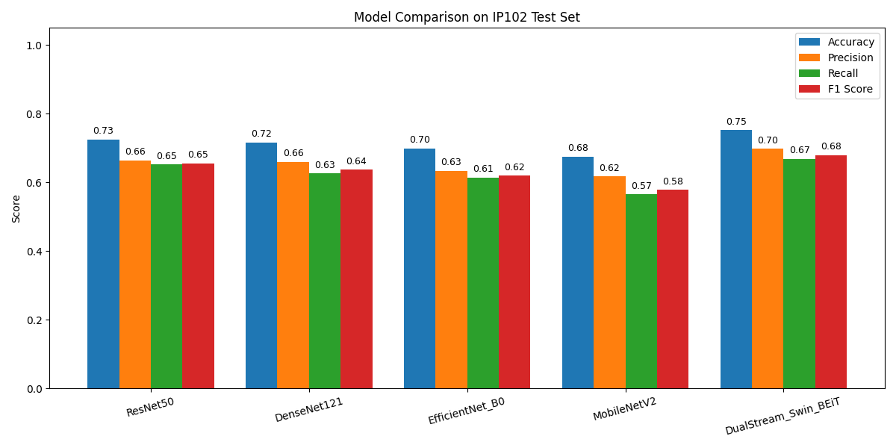

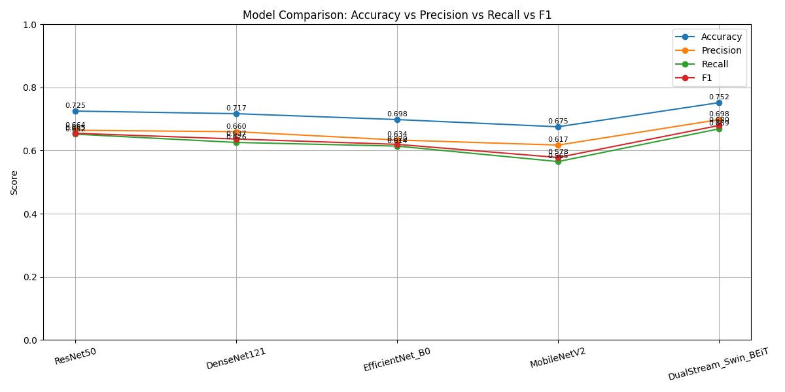

## Confusion Matrix Analysis

The confusion matrices show how each model performs across insect pest classes and where class confusion occurs.

### ResNet50

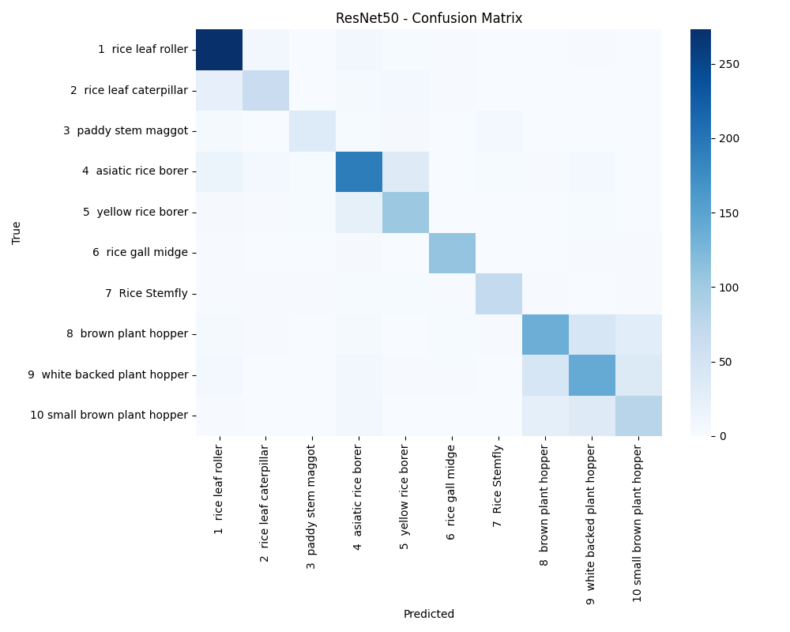

### DenseNet121

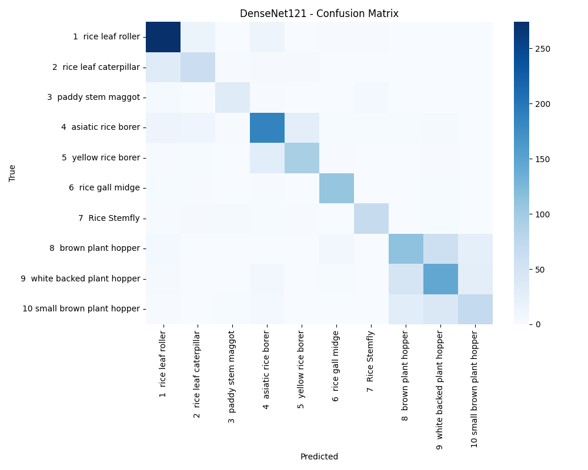

### EfficientNet-B0

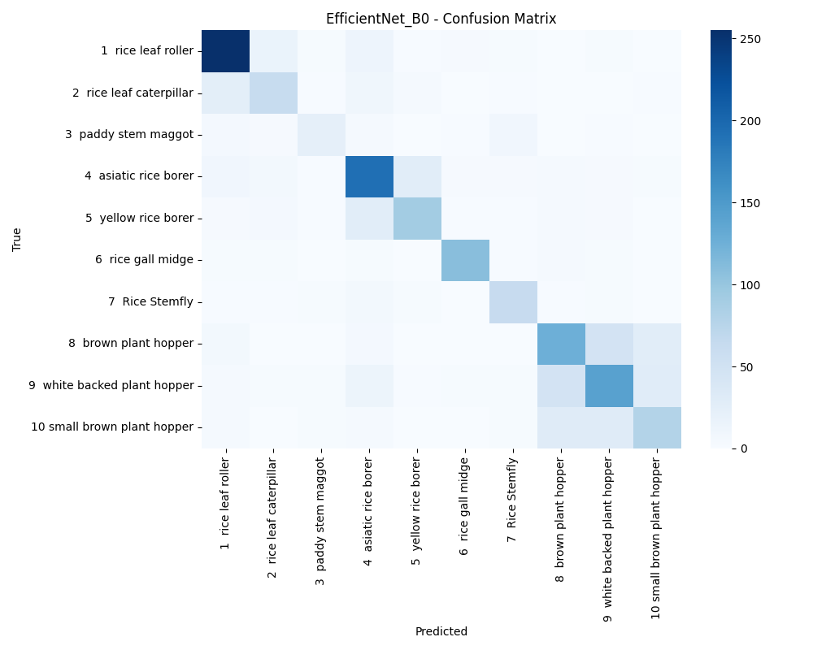

### MobileNetV2

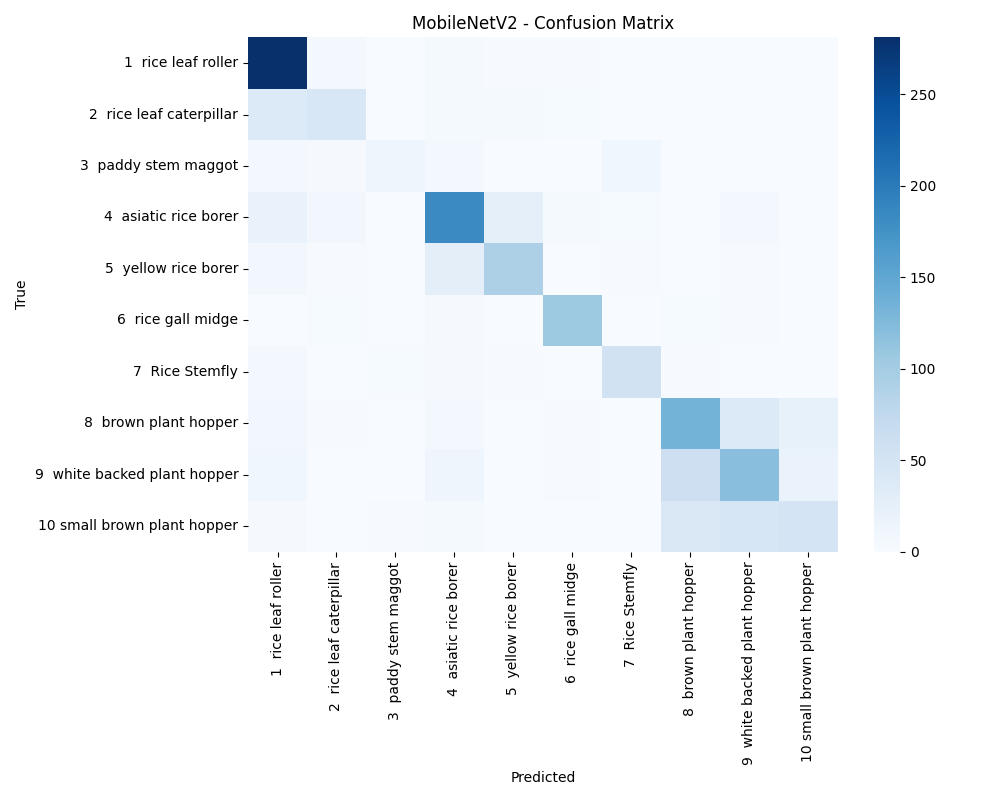

### DualStream Swin-BEiT

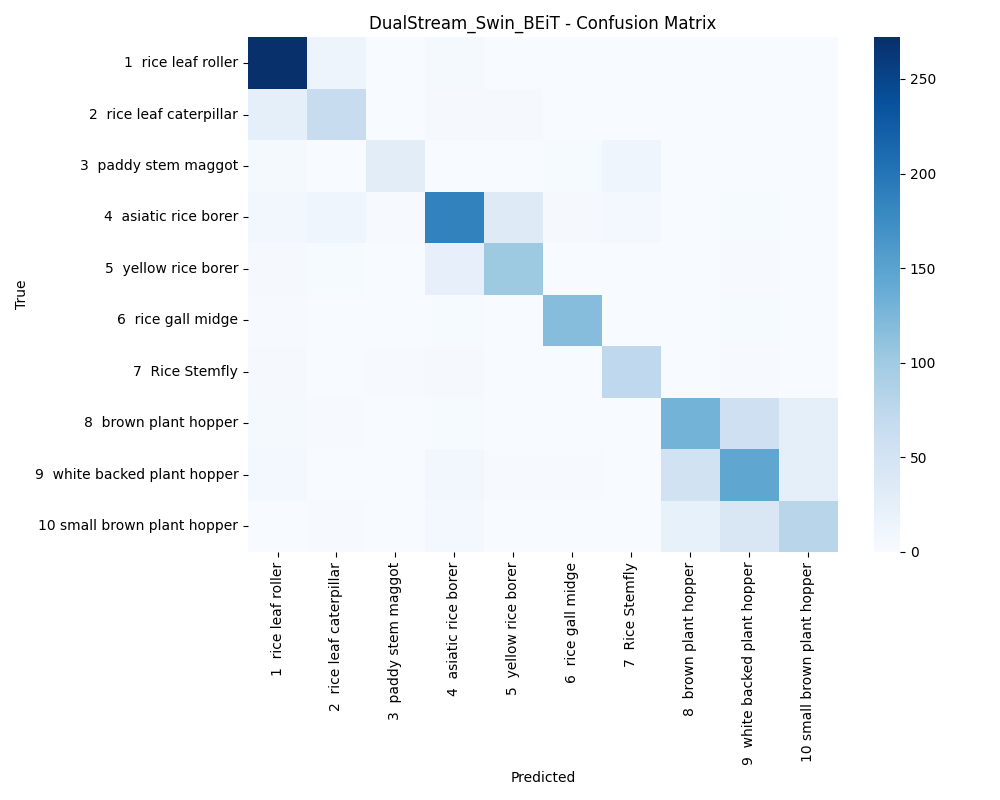

## Per-Class Accuracy Analysis

The project also compares the top-performing classes for each model.

### ResNet50

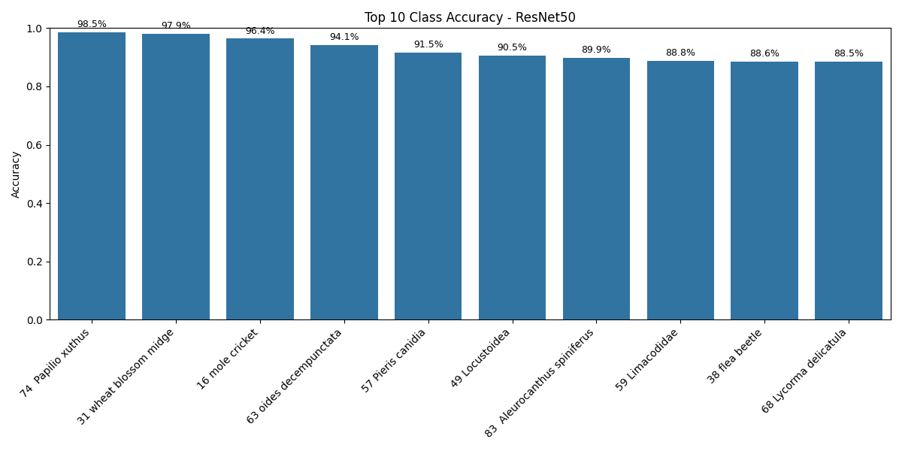

### DenseNet121

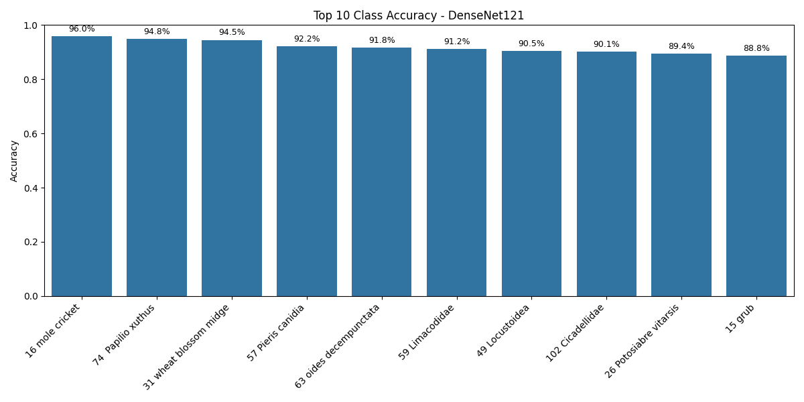

### EfficientNet-B0

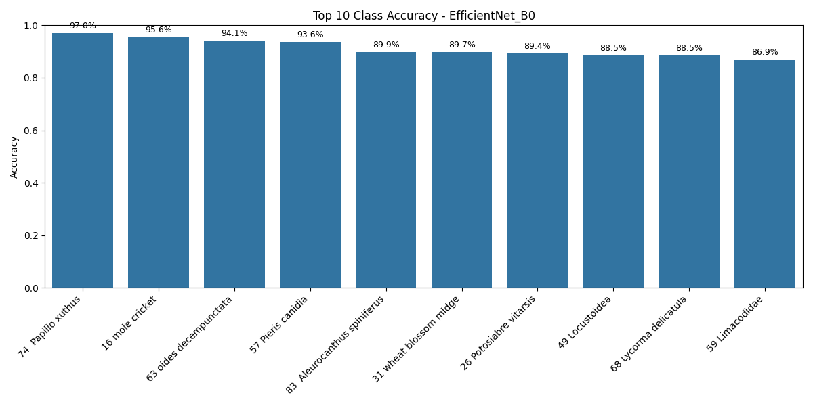

### MobileNetV2

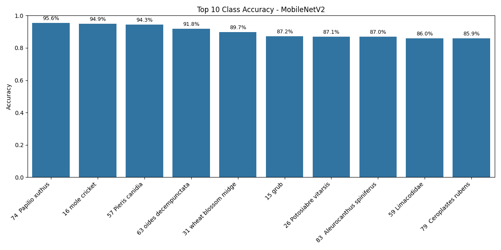

### DualStream Swin-BEiT

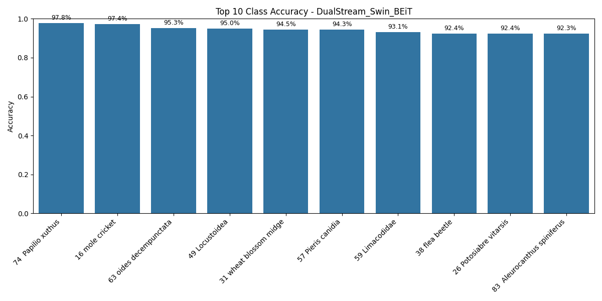

## Grad-CAM Visualisation

Grad-CAM is used to inspect which image regions different models focus on when making predictions.

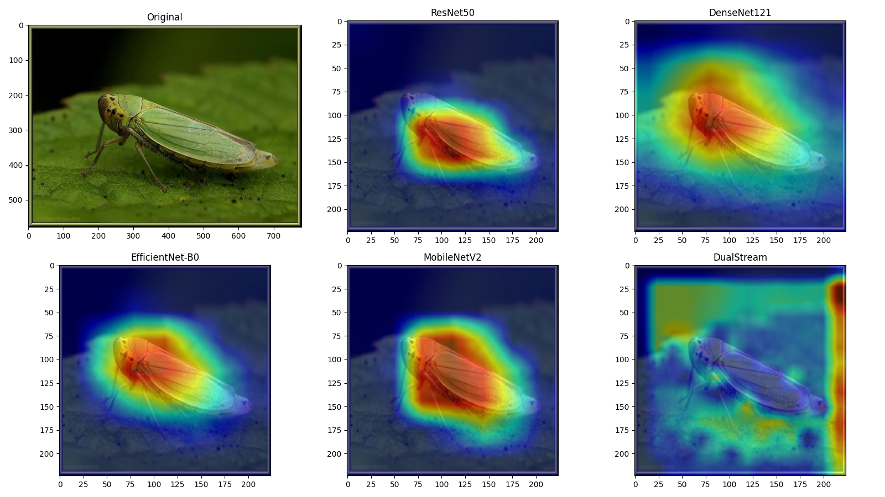

The Grad-CAM figure is a derived visualisation generated during model evaluation. The full raw dataset, standalone raw image files, pretrained weights, and trained checkpoints are not redistributed in this repository.

## Key Findings

* The DualStream Swin-BEiT model produced the best overall test-set accuracy and weighted F1-score.
* CNN baselines remained competitive, especially ResNet50 and DenseNet121.
* MobileNetV2 showed lower overall performance but remains useful as a lightweight baseline.
* Per-class accuracy varied noticeably across models, reflecting the fine-grained and imbalanced nature of the dataset.
* Grad-CAM visualisation provided an interpretable way to compare model attention patterns.

## How to Reproduce

1. Clone this repository.

```bash
git clone https://github.com/MackintoshCHN/fine-grained-insect-pest-classification.git
cd fine-grained-insect-pest-classification
```

2. Install dependencies.

```bash
pip install -r requirements.txt
```

3. Download the IP102 dataset archive and pretrained ResNet50 file from the official IP102 resources.

4. Upload the following files to Google Drive:

```text
/content/drive/MyDrive/insect_pest_classification/
├── classes.txt
├── ip102_v1.1.tar
└── resnet50_0.497.pkl
```

5. Open and run:

```text
insect_pest_classification.ipynb
```

6. Run the notebook cells in order.

For local execution, modify the Google Drive paths in the notebook so that they point to the local dataset and output directories.

## Files Not Included

The following files are intentionally excluded from this repository:

```text
ip102_v1.1.tar
ip102_v1.1/
images/
resnet50_0.497.pkl
*.pth
*.pt
*.ckpt
*.pkl
insect_pest_classification_outputs.zip
```

These files are excluded because they are large dataset, pretrained-weight, checkpoint, or generated-output files.

## Usage Notes

This repository contains implementation code, experiment outputs, and derived visualisations for reproducible experimentation.

The IP102 full raw dataset, standalone raw image files, pretrained weights, and trained checkpoints are not redistributed in this repository. Please refer to the official IP102 repository for dataset access, usage restrictions, and citation requirements.

The TXT and PNG files committed under `reports/` and `figures/` are generated experiment outputs and derived visualisations from the completed run, not redistributed raw dataset files.

## License and Reuse

No open-source license is currently granted for this repository. The notebook, generated reports, and generated figures are provided for reference only unless otherwise stated.

The IP102 dataset, class labels, pretrained weights, and related third-party resources remain governed by their original access terms and citation requirements.

## Acknowledgement and Citation

This project uses the IP102 dataset and related resources from the official IP102 repository:

* Dataset repository: `https://github.com/xpwu95/IP102`
* Class labels: `classes.txt` from the official IP102 repository
* Dataset archive: `ip102_v1.1.tar` from the dataset download link provided by the official repository
* Pretrained ResNet50 weights: `resnet50_0.497.pkl` from the pretrained model resources provided by the official repository

The raw dataset, standalone raw image files, pretrained weights, and trained checkpoints are not redistributed in this repository.

If you use the IP102 dataset, please cite the original paper:

```bibtex
@inproceedings{wu2019ip102,
  title={IP102: A Large-Scale Benchmark Dataset for Insect Pest Recognition},
  author={Wu, Xiaoping and Zhan, Chi and Lai, Yu-Kun and Cheng, Ming-Ming and Yang, Jufeng},
  booktitle={Proceedings of the IEEE/CVF Conference on Computer Vision and Pattern Recognition},
  pages={8787--8796},
  year={2019}
}
```

## References

* Xiaoping Wu, Chi Zhan, Yu-Kun Lai, Ming-Ming Cheng, and Jufeng Yang. IP102: A Large-Scale Benchmark Dataset for Insect Pest Recognition. CVPR 2019.
  `https://openaccess.thecvf.com/content_CVPR_2019/papers/Wu_IP102_A_Large-Scale_Benchmark_Dataset_for_Insect_Pest_Recognition_CVPR_2019_paper.pdf`

* Official IP102 repository.
  `https://github.com/xpwu95/IP102`

* A. Setiawan, N. Yudistira, and R. C. Wihandika. Large scale pest classification using efficient Convolutional Network with augmentation and regularizers. Computers and Electronics in Agriculture, 2022.
  `https://www.sciencedirect.com/science/article/pii/S0168169922005191`

* W. Linfeng, L. Yong, L. Jiayao, W. Yunsheng, and X. Shipu. Based on the multi-scale information sharing network of fine-grained attention for agricultural pest detection. PLOS ONE, 2023.
  `https://journals.plos.org/plosone/article?id=10.1371/journal.pone.0286732`

* J. An, Y. Du, P. Hong, L. Zhang, and X. Weng. Insect recognition based on complementary features from multiple views. Scientific Reports, 2023.
  `https://europepmc.org/article/pmc/pmc9940688`

* S. Kar, J. Nagasubramanian, D. Elango, M. E. Carroll, C. A. Abel, A. Nair, D. S. Mueller, M. E. O'Neal, A. K. Singh, S. Sarkar, B. Ganapathysubramanian, and A. Singh. Self-supervised learning improves classification of agriculturally important insect pests in plants. The Plant Phenome Journal, 2023.
  `https://acsess.onlinelibrary.wiley.com/doi/full/10.1002/ppj2.20079`

## Limitations

* The dataset has a long-tailed class distribution, which affects minority-class performance.
* The project focuses on image-level classification rather than object detection or instance segmentation.
* The pretrained weights and raw dataset must be downloaded separately.
* The notebook is optimised for Google Colab rather than a fully packaged command-line training pipeline.
* The included result visualisations are generated from one experimental run and may vary under different random seeds, hardware settings, or training configurations.
* Local execution requires manual path updates because the notebook uses Google Drive paths by default.

## Future Work

Potential extensions include:

* Applying class-balanced sampling or loss reweighting.
* Testing additional transformer backbones.
* Adding more systematic hyperparameter tuning.
* Converting the notebook workflow into reusable Python scripts.
* Exploring detection-based pest recognition for images containing multiple insects.
* Investigating lightweight deployment-oriented models with pruning or quantisation.

## Tech Stack

* Python
* PyTorch
* torchvision
* timm
* scikit-learn
* pandas
* NumPy
* Matplotlib
* Seaborn
* Grad-CAM
* Google Colab
